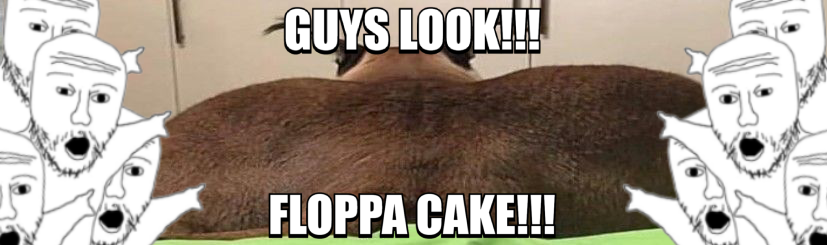
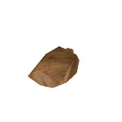

<!-- 🌟 HERO SECTION -->
<h1 align="center">Hi, I'm <strong>Alexey Floppa</strong> 😼</h1>

  Builder. Automator. Floppa at heart.

---

<!-- 📸 DAILY FLOPPA -->
<h2 align="center">📸 Daily Floppa</h2>

  

<h3 align="center">🎲 Bonus Floppas</h3>

  
  
  
  
  

---

<!-- 🤯 ABOUT ME -->
<h2 align="center">🛋️ About Me</h2>

  Hi, I'm Alexey. I'm 15 years old, and I started building things because I liked solving problems in my own way. I don't come from some big dev background — I just kept learning what I needed, one step at a time.

  I enjoy building things that are both logical and visually clean. I try to keep everything simple but well thought-out, so it actually works in real life. I'm not chasing trends or writing code for screenshots — I focus on structure, stability, and experience.

  I usually work on projects that I would actually use. Not because it sounds cool, but because it solves something annoying or helps me do things better. I don't grind through the night or write in chaos. I take my time, keep things organized, and prefer steady improvement over hype.

My general knowledge covers UI/UX design, frontend and backend dev, automation, databases, and some light AI. I’m not trying to know everything — just enough to build the things I want, the right way.

I approach projects like long-term investments: build once, build right, and keep it clean enough that I won’t hate it a year later.

🧠 Creator of <strong>Better.io</strong> — because your day deserves better structure

⚙️ I automate repetitive work so you don’t have to think about it

🌙 Most of my best code comes from late, quiet hours

---

<!-- 🚀 FEATURED PROJECT -->
<h2 align="center">🚀 Featured Project</h2>
<h3 align="center">🌱 Better.io 🌱</h2>

  Better.io isn’t just another app. It’s quiet structure. It’s control without pressure. It’s your system, your way. Designed for people who value their time and don’t want distractions in the way. 
  📆 Calendar and habits with calm reminders 
  📈 Task stats and AI analysis — without the noise 
  🎨 Fully customizable, so it feels like yours 
  📦 Local-first and fast. No cloud dependency

---

<!-- 📜 TIMELINE -->
<h2 align="center">📜 Developer Timeline</h2>

  My journey in coding began in 2020, when I was 10 years old and started with C#. I was just exploring, curious about how programs work. In 2021, I switched to Python — the simplicity and logic of it made it a great next step. That same year, I got into frontend web development with HTML, CSS, and JavaScript.
    
  In 2022, I circled back to C#, this time through Unity. I was experimenting with building games and learning how to create interactive projects. From 2023 to 2024, I moved between all the tools I had learned, mixing them as needed. I was less focused on learning new languages, and more focused on improving how I build.
    
  In late 2024, I discovered Dart and Flutter. They gave me the control and flexibility I needed to build mobile and desktop apps the way I envisioned them. That’s also when I decided it was time to organize my projects properly — and finally set up GitHub.
    
  Everything you see here is the result of that ongoing journey — one where I’m always learning, refining, and building tools that are useful, real, and future-proof.

---

<!-- 📊 STATS -->
<h2 align="center">📊 GitHub Stats</h2>

  <picture>
    <source media="(prefers-color-scheme: dark)" srcset="https://github-readme-stats.vercel.app/api?show_icons=true&theme=tokyonight&hide_border=true&username=AlexeyFloppa">
    
  </picture>

  <picture>
    <source media="(prefers-color-scheme: dark)" srcset="https://streak-stats.demolab.com?theme=tokyonight&hide_border=true&user=AlexeyFloppa">
    
  </picture>

  <picture>
    <source media="(prefers-color-scheme: dark)" srcset="https://github-readme-stats.vercel.app/api/top-langs/?layout=compact&theme=tokyonight&hide_border=true&username=AlexeyFloppa">
    
  </picture>

<!-- 🐍 SNAKE -->

  <picture>
    <source media="(prefers-color-scheme: dark)" srcset="https://raw.githubusercontent.com/AlexeyFloppa/AlexeyFloppa/output/github-contribution-grid-snake-dark.svg">
    
  </picture>

<!-- 📊 STATS -->
<h2 align="center">📊 LeetCode Stats</h2>

  <picture>
  <source media="(prefers-color-scheme: dark)" srcset="https://leetcard.jacoblin.cool/alexey_floppa?font=Roboto">
  
  </picture>

---

<!-- 🧰 TOOLS -->
<h2 align="center">🧰 Toolbox</h2>

  
  
  
    
  
  
   

---

<!-- 📬 CONTACT -->
<h2 align="center">📬 Connect With Me</h2>

  
  
  
  
  
  

---
<!-- ENDING -->

  

  

<h3 align="center">Thank You for reading my readme! 🙏✨</h3>

Wishing you an amazing day ahead! 🌟💻🐾

